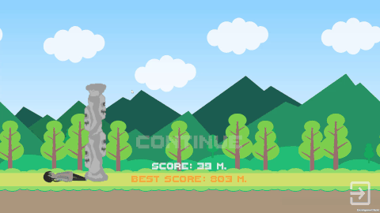
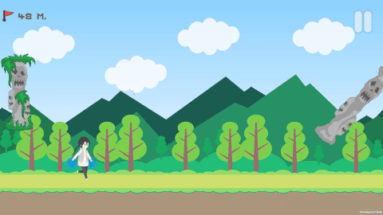
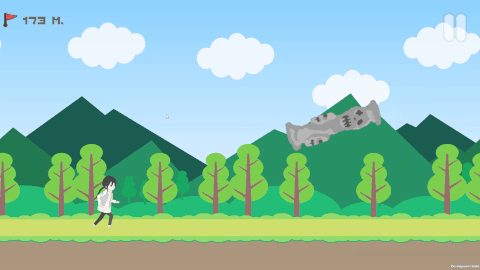

# RunGirl

2D бесконечный раннер в жанре Jetpack Joyride - событийная архитектура,
нарастающая сложность и полная адаптация под любое соотношение сторон экрана.

---

## Демонстрация

---

## Ключевые механики

**Event-driven архитектура без прямых зависимостей**
Все системы общаются через `static event Action`. `ObstacleTrigger.OnPlayerHit`
одним событием останавливает параллакс, мувер препятствий, трекер дистанции
и запускает Game Over UI - без единой прямой ссылки между компонентами.
`MainMenuController.StartGamePlay` запускает игру синхронно для плеера,
трекера и UI. Каждый класс подписывается в `OnEnable` и отписывается в
`OnDisable` - утечек не возникает.

**Адаптация под любое разрешение через `BordersData` Singleton**
`BordersData` вычисляет границы экрана через `ViewportToWorldPoint` при
`Awake` и служит единым источником координат для всех систем. `ObstacleMover`
пересчитывает `SpeedMove` через коэффициент `currentWidth / BaseCameraWidth`,
чтобы визуальная скорость была одинаковой на 16:9 и 4:3. `ParallaxController`
растягивает каждый Quad фона точно по viewport через `orthographicSize * aspect`.
Спаунер и лазер берут позиции спауна из `BordersData.MaxX / MinY` - не из
захардкоженных чисел.

**Параллакс через UV-сдвиг материала**
Фоновые объекты не двигаются - каждый из 5 слоёв сдвигает `mainTextureOffset`
своего материала со своей скоростью из `LayerBackground` ScriptableObject.
4 темы фона (горы, пустыня, кладбище, снег) - каждая набор из 5 SO-конфигов.

**Object Pool + рандомизация препятствий**
`ObstaclesSpawner` создаёт все объекты при `Awake` и выключает их. В рантайме
только `SetActive` — никакого `Instantiate`. При каждом включении
`ObstacleRandomConfig` рандомизирует спрайт, высоту и угол поворота
(-45°/0°/45°) с защитой от повтора одного угла подряд.

**Лазер как отдельная state-машина**
Самое сложное препятствие реализовано через цепочку событий: генератор
въезжает с края => `StartLaserJob` => лазер анимированно появляется через Lerp
масштаба => ждёт `LifeTime` секунд => исчезает => `LaserEndJob` => генератор
уезжает => `DisableLaserObstacle`. Три варианта позиционирования двух лучей
при каждом появлении.

**Нарастающая сложность с прогрессивным шагом**
Каждые `DistanceStep` метров `DistanceTracker` рассылает `GameSpeedUp` всем
подписчикам. После каждого ускорения `DistanceStep *= 1.1f` - следующий порог
всегда дальше предыдущего, кривая сложности нелинейная.

---

## Технический стек

| | |
|---|---|
| **Движок** | Unity 2022.2.0b16 |
| **Язык** | C# |
| **Паттерны** | Observer (static events), Template Method (AbstractRareObstacle), Singleton (BordersData), Object Pool |
| **Данные** | ScriptableObject (конфиги параллакс-слоёв) |
| **Физика** | Rigidbody2D + Lerp для плавного полёта |
| **Анимации** | Skeletal (Animator), ParticleSystem |
| **UI** | Unity UI Canvas, TextMeshPro |
| **Сохранение** | PlayerPrefs (лучший результат) |
| **Ассеты** | Cute 2D College Student, Free 2D Cartoon Parallax Background |

---

## Что я узнал

Событийная архитектура через `static event Action` - главный архитектурный
выбор проекта. Когда игрок умирает, одно событие без цепочки вызовов
останавливает всё. Главная ловушка - забыть отписаться в `OnDisable`, что
приводит к вызовам на уничтоженных объектах. Решил это строгим правилом:
каждый `+=` в `OnEnable` имеет пару `-=` в `OnDisable`.

Параллакс через UV-сдвиг текстуры вместо движения объектов - неочевидное
решение. Попытка двигать спрайты давала артефакты на стыках и требовала
сложного зацикливания. `material.mainTextureOffset` на Quad решает это в одну
строку и не создаёт проблем с границами.

`AbstractRareObstacle` появился как рефакторинг: лазер и вращающееся
препятствие имели одинаковую логику «появись через N обычных». Вынес счётчик
и `ShouldSpawn()` в базовый класс - каждый подкласс реализует только свою
деактивацию.

Адаптация под разрешение потребовала согласовать несколько независимых систем
через единый `BordersData`. Без него каждая система хардкодила свои координаты
и игра ломалась на нестандартных экранах.

---

## Как запустить

1. Клонировать репозиторий
2. Открыть в **Unity 2022.2.0b16**
3. Запустить сцену `LevelScene`
4. Управление: **Space** (ПК) или тап по экрану (мобильный)

---

## Использованные ассеты

- [Cute 2D - College Student](https://assetstore.unity.com/packages/2d/characters/cute-2d-college-student-198684) - персонаж и AnimationClips
- [Free 2D Cartoon Parallax Background](https://assetstore.unity.com/packages/2d/environments/free-2d-cartoon-parallax-background-205812) - спрайты для фона
- [Pixel Font - Tripfive](https://assetstore.unity.com/packages/2d/fonts/pixel-font-tripfive-17553) - пиксельный шрифт для UI
